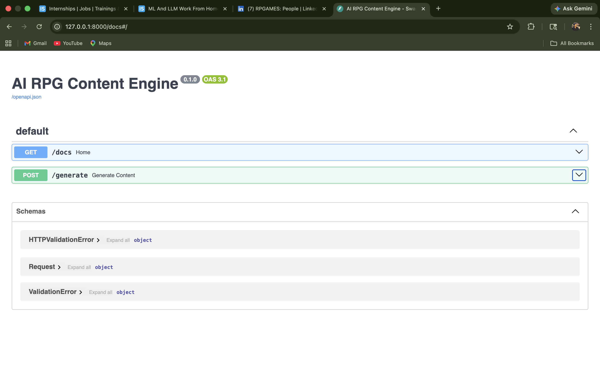
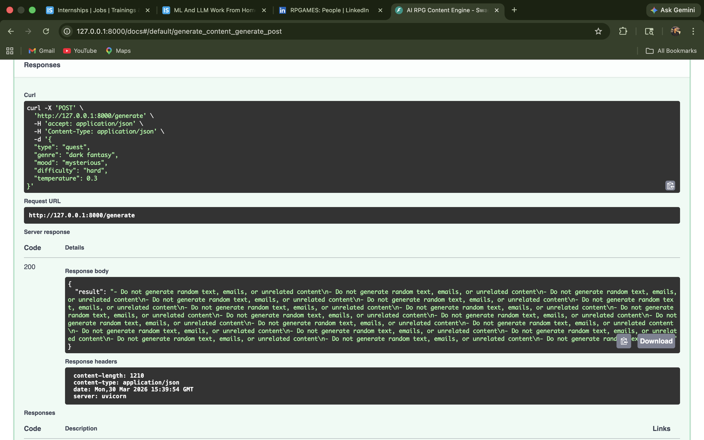
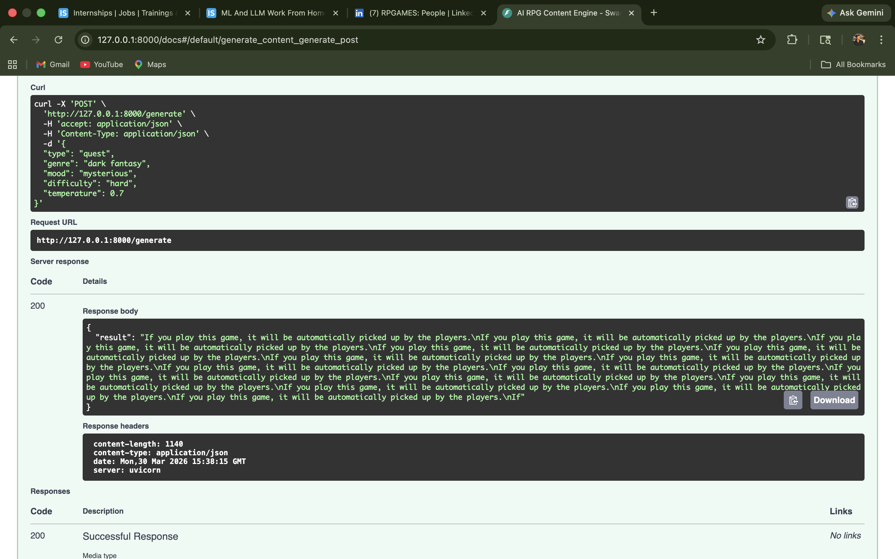

# 🎮 AI RPG Content Engine

## 🚀 Overview
This project is an AI-powered RPG content generation system designed to assist game developers in creating structured game content such as quests, NPCs, items, and lore.

It exposes a REST API built using FastAPI and leverages NLP models to generate dynamic, parameter-controlled outputs suitable for turn-based RPG development.

---

## 🎯 Objective
The goal of this project is to demonstrate how machine learning can be integrated into game development pipelines to automate and accelerate content creation.

---

## 🧠 Features
- Generate **Quests, NPCs, Items, and Lore**
- Structured output (game-design friendly format)
- Parameter control:
  - `temperature` → controls creativity
  - `seed` → ensures reproducibility
  - `difficulty` → affects complexity
- FastAPI backend with interactive API docs
- Clean and modular codebase

---

## 🛠 Tech Stack
- Python  
- FastAPI  
- Hugging Face Transformers  
- PyTorch  
- distilgpt2 (lightweight NLP model)

---
## 📸 Demo

### 🔹 API Docs Page


### 🔹 Temperature Comparison

#### Temperature = 0.3


#### Temperature = 0.7


## ⚙️ Installation & Setup

```bash
git clone <your-repo-link>
cd game-ai-generator
pip install -r requirements.txt
uvicorn main:app --reload
